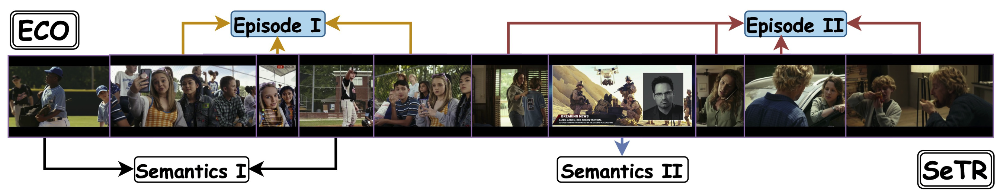
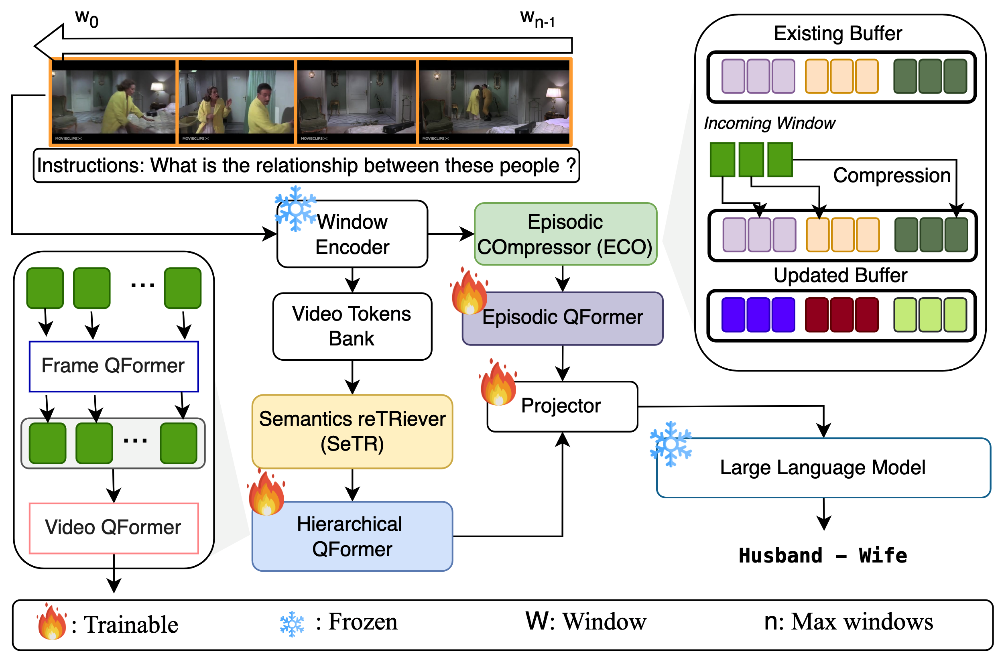
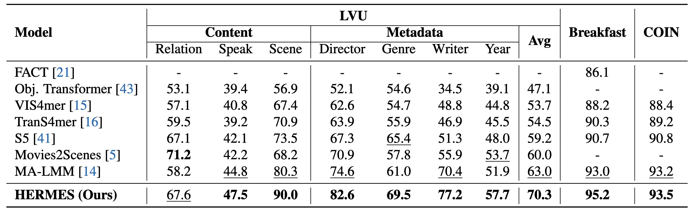
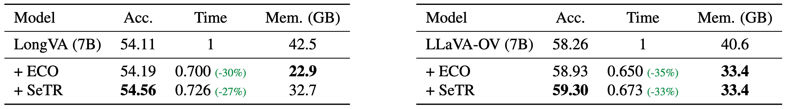

<div align="center">
  
</div>


# HERMES: temporal-coHERent long-forM understanding with Episodes and Semantics

[](https://paperswithcode.com/sota/video-classification-on-breakfast?p=bridging-episodes-and-semantics-a-novel)
[](https://paperswithcode.com/sota/video-classification-on-coin-1?p=bridging-episodes-and-semantics-a-novel)
[](https://paperswithcode.com/sota/zero-shot-long-video-global-model-question?p=bridging-episodes-and-semantics-a-novel)
[](https://paperswithcode.com/sota/zero-shot-long-video-breakpoint-mode-question?p=bridging-episodes-and-semantics-a-novel)

### [Project Page](https://joslefaure.github.io/assets/html/hermes.html) | [Paper](https://arxiv.org/abs/2408.17443)


## :fire: News
* **[2025.06.26]** Our paper **HERMES: temporal-coHERent long-forM understanding with Episodes and Semantics** has been accepted by ***ICCV'2025*** 🚀.
* **[2024.08.24]** :keyboard: Our short paper **BREASE: Bridging Episodes and Semantics, A Novel Framework for Long-Form Video Understanding** has been accepted by the EVAL-FoMo workshop at ***ECCV'24***.

<p align="center">

</p>


## Model Overview
<p align="center">

</p>

## Results


### Plug-and-Play Experiments



## Requirements

You can install the conda environment by running:
```bash
git clone https://github.com/joslefaure/HERMES.git
cd HERMES
pip install -e .
```

## Supported Datasets
- [LVU](https://github.com/chaoyuaw/lvu)
- [Breakfast](https://serre-lab.clps.brown.edu/resource/breakfast-actions-dataset/)
- [COIN](https://coin-dataset.github.io/)
- [MovieChat-1k](https://github.com/rese1f/MovieChat)

**Additionally, our modules can be plugged into other VLMs for faster inference and improved memory management.**

### Prepare MovieChat-1k
1. Download the train data (if you want to finetune HERMES) from [here](https://huggingface.co/datasets/Enxin/MovieChat-1K_train) and the test data from [here](https://huggingface.co/datasets/Enxin/MovieChat-1K-test/tree/main)
   
2. Extract the frames at 10FPS and organize it as follows:
```
├── data
    └── moviechat
        ├── annotation
        ├── frames
            └── {video_id}
                ├── frame000001.jpg
                ├── ...
```

## Running

### Download Pre-trained LLM
We use Vicuna-v1.1 (we report results using the 7B model only) as our pre-trained LLM weights, you can download from this [link](https://github.com/lm-sys/FastChat/blob/main/docs/vicuna_weights_version.md) and arrange in this format.

I prefer my `bert-base-uncased` locally, therefore I added it here too. Download it from [there](https://huggingface.co/google-bert/bert-base-uncased).
   ```
   ├── llm
        ├── vicuna-7b
        ├── vicuna-13b
        ├── bert-based-uncased
   ```
### Inference
We inference the model on 4 V100 GPUs (32GB). 

First add your openai API to the environment variable `export OPENAI_API_KEY='sk-*****` (only for moviechat dataset), as we use GPT3.5 for scoring. For the other datasets, we report top-1 accuracy.


```bash
# Zero-shot
bash run_scripts/moviechat/test.sh

# Fully-supervised
bash run_scripts/moviechat/test.sh path/to/your/model.pth
```
Same for the other datasets. All the scripts are included in `run_scripts`.

### Pretrained Checkpoints
Coming Soon

### Train
We train the model on 8 V100 GPUs (32GB).

```bash
bash run_scripts/{dataset}/train.sh
```

## Citation
If you find our code or our paper useful for your research, please **[★star]** this repo and **[cite]** the following paper:

```latex
@misc{faure2024hermestemporalcoherentlongformunderstanding,
      title={HERMES: temporal-coHERent long-forM understanding with Episodes and Semantics}, 
      author={Gueter Josmy Faure and Jia-Fong Yeh and Min-Hung Chen and Hung-Ting Su and Shang-Hong Lai and Winston H. Hsu},
      year={2024},
      eprint={2408.17443},
      archivePrefix={arXiv},
      primaryClass={cs.CV},
      url={https://arxiv.org/abs/2408.17443}, 
}
```


## Acknowledgement
We thank the authors of the following repositories for open-sourcing their code.
- [LAVIS](https://github.com/salesforce/LAVIS)
- [MA-LMM](https://github.com/boheumd/MA-LMM)


